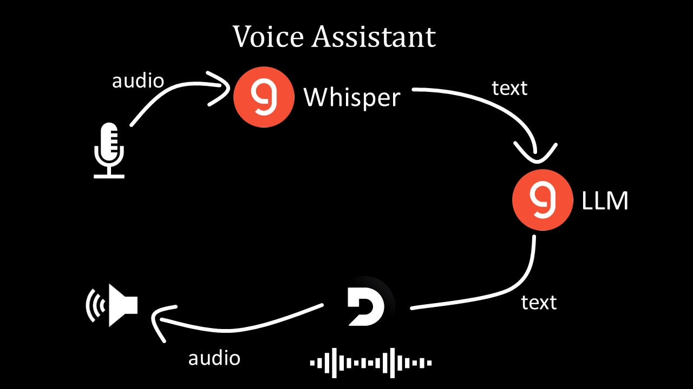

# Voice Assistant for Customer Queries
This project is a voice assistant designed to handle customer queries related to online shopping. It processes audio input, generates helpful responses, and delivers them back as audio output.

## Features
- Input via Microphone: Captures user speech in real time.  
- Speech-to-Text: Uses the Whisper model via Groq API to convert audio to text.  
- Natural Language Processing: Processes the text with a Large Language Model (LLM) using the Groq API and a defined prompt template:  
"You are a helpful assistant in handling customer queries related to online shopping."  
- Text-to-Speech: Converts the response text back to audio using Deepgram API.  
- Chat History Memory: Maintains chat history during a session to provide context-aware responses.

## Requirements
- Python 3.12  
- Conda (Anaconda/Miniconda) for virtual environment setup  
- API Keys for:  
    - Groq API  
    - Deepgram   
    - Langchain  

## Project Workflow
Below is a diagram illustrating the workflow of the voice assistant:  



## Limitations
While the current version performs well for basic tasks, there are a few limitations:  

1. **Not Real-Time Streaming**:  
The system processes inputs sequentially, which adds latency. It cannot yet support continuous streaming or immediate responses.  
2. **Requires Stable Internet**:  
API calls for Whisper, LLM processing, and text-to-speech require an active internet connection.  
3. **Language Support**:  
The system is capable of detecting multiple languages and generating responses, but it has not been thoroughly tested beyond English.
4. **Limited Customization**:  
The assistant's behavior is fixed to the prompt template provided.  
5. **Manual Session Management**:  
While chat history is maintained for a single session, users must manually restart or manage sessions to reset the memory.

## Future Updates
To improve the application, the following enhancements are planned:

#### Real-Time Streaming:
Implement WebSocket-based audio streaming to reduce response latency and allow for near-instantaneous replies.

#### Graph-Based Knowledge Representation:
Integrate a knowledge graph to provide better context-aware responses. For instance:
- Leverage tools like Neo4j for dynamic query-based responses.
- Enhance accuracy and performance in handling complex customer queries.

#### Multilingual Support:
Extend support for generating responses in multiple languages.

#### Voice Customization:
Allow users to customize the assistant's voice and tone using parameters available in Deepgram or similar TTS providers.

#### Customizable Prompts:
Provide users the ability to modify the assistant's behavior via prompt templates.

## Setup Instructions
Follow the steps below to set up and run the project:

### 1. Prerequisites
Ensure you have:  

- Anaconda/Miniconda installed  
- Python 3.12 installed  
- Access to the necessary API keys  
### 2. Clone the Repository
```bash
git clone https://github.com/yourusername/voice-assistant.git
cd voice-assistant
```
### 3. Create a Virtual Environment
Using Conda:

```bash
conda create -n voice_assistant_env python=3.12 -y
conda activate voice_assistant_env
```
### 4. Install Dependencies
Install required Python packages:

```bash
pip install -r requirements.txt
```
### 5. Configure API Keys
Create a .env file in the project folder and add your API keys:

```plaintext
GROQ_API_KEY=your_groq_api_key
DEEPGRAM_API_KEY=your_deepgram_api_key
LANGCHAIN_API_KEY=your_langchain_api_key
```
Replace the placeholders with your actual API keys.

### 6. Run the Application
Activate the environment and run the script:

```bash
conda activate voice_assistant_env
python app.py
```
### 7. How It Works
1. The app records audio input from the microphone.
2. The audio is converted to text using Whisper via Groq API.
3. The text is processed by an LLM with the defined prompt template.
4. The generated response is converted back to audio using Deepgram API.
5. The audio output is played back to the user.

## Project Structure
```bash
voice-assistant/
│-- app.py               # Main application script
│-- requirements.txt     # Project dependencies
│-- .env                 # API keys (not included in the repository)
│-- README.md            # Project documentation
``` 

## Contact
Manas Pareek - manasdps@gmail.com